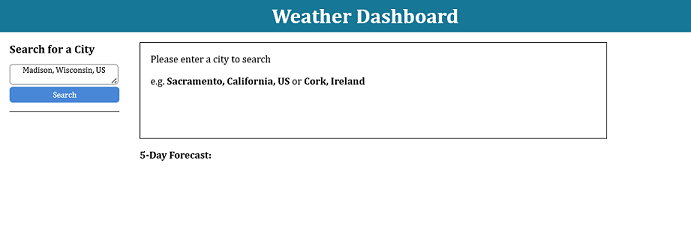
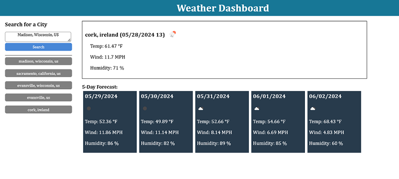
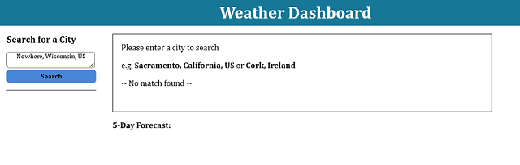

# Weather Dashboard

## Description

A simple weather dashboard that pulls weather information for a given city. Utilizes the Geocoding API https://openweathermap.org/api/geocoding-api to obtain the lat/lon for a city and then obtains the weather information using the 5 Day / 3 Hour Forecast API https://openweathermap.org/forecast5.

This app will run in the browser and feature dynamically updated HTML powered by jQuery.
Styling is managed with css and DayJS is used in processing of date/time.

## Table of Contents

- [General Functionality](#general-functionality)
- [Screenshots](#screen-shots)
- [Installation](#installation)
- [Usage](#usage)
- [Credits](#credits)
- [License](#license)

### General Functionality

#### Search

You can search for a city using the **Search for a City** input to enter a city. The more precise the criteria the more precise the outcome as the response will return the first match.
For the most precise format, use a **_"city, full state name, US"_** for cities in the US or **_"city, country"_** for cities outside the US.

#### History

Any search that returns a result will be added to the search history. Only 10 entries will be stored.

### Screen Shots

#### The Weather Dashboard

#### Search Result

#### Search Result (no match)

### Installation

You may clone the repository for access to the project files directly to copy/paste as needed. You may also fork the repository to utilize git actions to deploy as needed to support your workflows.

Since this is a static code project it may be deployed on any hosting platform supporting static code projects supporting html, css, and javascript including cloud providers:

- [AWS](https://aws.amazon.com/getting-started/hands-on/host-static-website/)
- [Azure](https://learn.microsoft.com/en-us/azure/static-web-apps/getting-started?tabs=vanilla-javascript)
- [Google Cloud](https://cloud.google.com/storage/docs/hosting-static-website)

Additionally, if your preference is more hands-on, you can deploy manually to:

- [IIS](https://learn.microsoft.com/en-us/iis/manage/creating-websites/scenario-build-a-static-website-on-iis)
- [Apache Tomcat](https://tomcat.apache.org/tomcat-9.0-doc/appdev/deployment.html)
- [Apache Http](https://fullstackdeveloper.guru/2021/04/08/how-to-deploy-html-javascript-code-to-apache-http-server/)

Or:

#### Run with Docker

- clone the repo `git clone https://github.com/ericroys-school/weather-dashboard.git`
- cd into the repo `cd weather-dashboard`
- run `docker build -t wboard:latest . && docker run -d -p 9001:80 --name wboard wboard`
  _note_: choose a port other than 9001 if you wish
- open your browser to `http://localhost:9001`

## Usage

This web project is currently deployed [on Github Pages](https://ericroys-school.github.io/weather-dashboard/)

## Credits

I would like to thank my bearded dragons for the timely distractions to support proper posture and work-life balance.

## License

This project is licensed with the "Unlicense" license. [(Read more here)](LICENSE)

## How to Contribute

Thank you, but we are not seeking any contributions at this time unless you want to send $$,
which is always welcome.

## Tests

The project was unit tested while being developed. Automated testing will be added in future projects.
